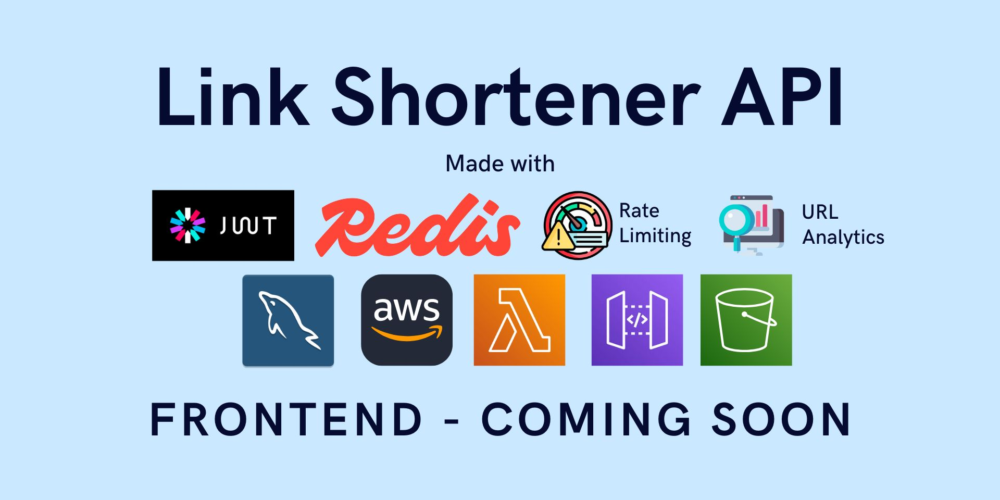

# **Aether Link API (AWS | Aiven)**



🚀 A **high-performance URL Shortener API** for developers & businesses, offering a production-ready link management
solution with scalable link shortening & analytics. Built using **Spring Boot** for robust backend operations. Features
**JWT authentication**, **Redis caching**, **Rate limiting**, **URL Analytics** & **MySQL** for persistent storage.
Deployed as a cost-efficient serverless system on **AWS Lambda** via **API Gateway** with fully managed **Aiven** cloud
databases—perfect for startups & enterprises alike who want a high-availability, low-maintenance link shortener without
infrastructure overhead.

🔹 **Shorten** long URLs into compact, shareable links  
🔹 **Redirect** with 302 / 301 status codes  
🔹 **Track clicks**, devices, & referrers  
🔹 **JWT authentication** for user-specific URLs & secure access  
🔹 **Redis** for lightning-fast url caching  
🔹 **Rate limiting** to prevent site abuse  
🔹 **Admin dashboard** for system monitoring

[](https://gkw7gdy5e5.execute-api.eu-north-1.amazonaws.com/v1/ping)

## **🤔 Why This Project? (Solves 3 Real-World Problems)**

### **1. Problem: Link Sharing Overhead**

- **Pain Point**: Long URLs break in emails / messaging apps & look unprofessional.
- **Solution**:
    - ✅ **Tiny Links**: Convert `https://en.wikipedia.org/wiki/Hubble_Ultra-Deep_Field#Hubble_eXtreme_Deep_Field` →
      `https://aether.ly/hubble`
    - ✅ **Brand Control**: Custom short codes (`aether.ly/abcdef`) - Max 6 characters.
    - ✅ **Cache Optimization**: Redis ensures 10,000+ redirects / second with <50ms latency

### **2. Problem: No Link Insights**

- **Pain Point**: Standard links offer zero analytics—you can’t track clicks or audience.
- **Solution**:
    - ✅ **Click Analytics**: Track devices, referrers, & geographic data (even without a UI)
    - ✅ **Own Your Data**: Self-hosted on AWS
    - ✅ **JWT Security**: Only link owners / admins can view analytics

### **3. Problem: API Abuse Risk**

- **Pain Point**: Public APIs attract spam & DDoS attacks.
- **Solution**:
    - ✅ **Redis Rate Limiting**: Blocks brute-force attacks (100 requests per minute - By IP / User ID session)
    - ✅ **AWS Lambda Auto-Scale**: Handles traffic spikes without downtime
    - ✅ **Cost Control**: Serverless scales to zero when unused (~$0.02 per 10K redirects)

## **📊 Market comparison**

- Some main functionalities of **Aether Link API** were inspired from other 3rd party link shortening apps.
- Below are some features that co-relate between This API & popular Bit.ly platform.


| **Feature**         | **This API**                  | **Bit.ly**        |  
|---------------------|-------------------------------|-------------------|  
| **Self-Hosted**     | ✅ Yes (AWS / Aiven)          | ❌ No             |  
| **Custom Domain**   | ✅ Yes (Domain price applies) | ✅ Yes (Premium)  |  
| **API Rate Limits** | ✅ Configurable               | ❌ Strict quotas  |  
| **Data Ownership**  | ✅ Your infrastructure        | ❌ Their servers  |  
| **Cost (10K reqs)** | ~$0.02                        | ~$50/month        |  


Differentiator? This project's API **keeps your link data private** while costing close to $0. Meaning it is almost 100x
more cost-effective than most 3rd party apps for the first 10,000 requests if deployed as an AWS Lambda function.

## **✨ Key Features**

### **🔗 URL Shortening**

- **Generate short codes for long URLs**
    - *Custom*  → short code can be given (min 3 - 6 max characters)
    - *Random*  → short code generated if not user specified
- Associate created URLs with authenticated users
- Load created short codes on API to get redirected to appropriate long URL.
- Delete created short codes based on short code name (Auth User / Admin only)
- Set expiration dates for temporary links (Work in Progress)

### **⚡ High-Performance Redirects**

- Redis caching for sub-millisecond response times
- Significantly reduce multiple queries being hit on MySQL database.
- 1st hit will miss on any short code due API startup (Lambda function cold start)
- After cold start, almost 99% hits direct on redis cache memory with no effect to MySQL database
- Short Links return with status code 302 (temporary) & 301 (permanent) redirects
- All short codes are cached in redis up to 1 hour upon initial hit
- Short codes stay cached if hit from multiple IPs constantly with no time limit
- Top accessed short code links remain cached until traffic cools down

### **📊 Analytics**

- Each click from a short code is tracked in Real-time
- URL analytics data of User for each short code shows
- **Total clicks** for given **Short code**
- **Original long URL** for given **Short code**
- **Accessed date** for given **Short code**
- **IP address** that connected to **Short code**
- **Referer** identifies address from which resource **Short code** was requested from
- **Device type** detection (Mobile / Desktop / Tablet)

### **🔐 Security**

- **JWT Authentication**
    - Stateless token validation using `jjwt` library
    - HS256 algorithm with 256-bit secret key
    - Token expiration (configurable, default: 24 hours)
    - Secure cookie-less implementation (Bearer tokens in `Authorization` header)

- **Role-Based Access Control (RBAC)**
    - `USER` role: can create/delete own URLs, view user's URL analytics
    - `ADMIN` role: full system access (manage all URLs/users)
    - Implemented via Spring Security’s `@PreAuthorize("hasRole('ADMIN')")`

- **Password Security**
    - BCrypt hashing (strength: 10) with automatic salting
    - Prevents rainbow table attacks
    - Secure credential storage in Aiven MySQL

- **Additional Measures**
    - HTTPS enforcement via API Gateway
    - CORS restricted to trusted domains
    - SQL injection prevention through JPA parameterized queries

### **🛡️ Abuse Protection**

- **Rate Limiting**
    - **Bucket4j** algorithm (token bucket)
    - Uses **in-memory ConcurrentHashMap** for storing rate limit buckets.
    - **Two-tier throttling available**:
        - Currently, 100 requests per minute by IP / User
    - **IP-Based Protection:** X-Forwarded-For header parsing to handle proxies
- **Request Validation**
    - URL format verification (`@URL` annotation)
    - Short code sanitization (alphanumeric only)

### **👨‍💻 Admin Features**

- **URL Management**
    - View all created shortened URLs
    - Create any short code for long URL
    - Delete any existing short code for long URL

- **User Management**
    - List all created users
    - Toggle user active/inactive
    - Promote users to admin

- **System Monitoring**
    - Real-time short code URL stats
    - API usage analytics (endpoint call frequency)

## **🛠 Tech Stack**

### **Backend**

- **Spring Boot 3** - Core application framework
- **Spring Web** - REST API endpoints (Tomcat excluded for AWS Lambda)
- **Spring Data JPA** - MySQL persistence with Aiven
- **Spring Security** - JWT authentication & authorization
- **Spring Cache** - Redis integration via Lettuce
- **Bucket4j** - Distributed rate limiting
- **JJWT** - Secure JWT token handling

### **Infrastructure**

- **AWS Lambda** - Serverless execution
- **API Gateway** - HTTP endpoint routing
- **Aiven MySQL** - Managed relational database
- **Aiven Valkey** - Managed low-latency Redis caching

### **Why This Stack?**

| **Challenge**           | **Solution**                         | **Tech Used**           |  
|-------------------------|--------------------------------------|-------------------------|  
| High redirect traffic   | Redis cache (sub-ms latency)         | Aiven Redis             |  
| User-specific analytics | JWT claims + MySQL joins             | Spring Security + MySQL |  
| Abuse prevention        | In-memory Token-bucket rate limiting | Bucket4j                |  
| No server maintenance   | Serverless deployment                | AWS Lambda              |  

### **Key Dependencies**

| Dependency                       | Purpose                           |  
|----------------------------------|-----------------------------------|  
| `spring-boot-starter-web`        | REST API endpoints                |  
| `spring-boot-starter-data-jpa`   | MySQL persistence                 |  
| `spring-boot-starter-data-redis` | Local / Cloud Redis caching       |  
| `spring-boot-starter-validation` | Request payload validation        |  
| `jjwt`                           | JWT token generation / validation |  
| `bucket4j-core`                  | Rate limiting algorithm           |  
| `lombok`                         | Boilerplate reduction             |  
| `aws-serverless-java-container`  | Lambda Spring Boot integration    |  
| `mysql-connector-j`              | Local / Cloud database connection |

## **🚀 Deployment Architecture**


Above diagram outlines the high-level architecture of **Aether Link API**, leveraging AWS services & external
Aiven data stores. It illustrates flow of requests from a client, the deployment process, & how different components
interact to provide the URL shortening functionality.

* **Client/User** sends HTTP requests to the API.
* **Developer** build & deploy the application code.
* **AWS S3 Bucket** (Amazon Simple Storage Service S3 bucket). This object storage service serves as deployment target
  for the API.
    * Since the maximum size for an AWS Lambda deployment package (code & dependencies) is 50 MB.
    * This API when packaged (Built as assembly-zip) surpassed the size limit.
    * So it was deployed manually to AWS S3. This process will be automated soon.
* **Amazon API Gateway** is a fully managed service.
    * Lets developers create, publish, maintain, monitor, & secure APIs at any scale.
    * **"HTTPS Requests"** (likely GET, POST, etc.) are sent to the API Gateway.
    * The API Gateway is configured to **"Trigger"** an AWS Lambda Function upon receiving these requests.
    * It acts as the entry point for all client interactions with the backend logic.
* **AWS Lambda Function**: is a serverless compute service that lets you run code without provisioning or managing
  servers.
    * It **"Pulls S3 URI"** when the Lambda function is invoked, (the assembly-zip) from S3 Bucket.
    * The **Spring Boot API** is packaged & executed as a stateless function within Lambda. (Instead of running a
      persistent Spring Boot server)
    * The Lambda function sends its logs (application logs, errors, execution details) to **AWS CloudWatch**.
* **AWS CloudWatch** is a monitoring service that provides data & actionable insights to monitor applications.
* **Spring Boot API** is the core business logic of the URL Shortener application.
    * It handles the actual URL shortening & redirection logic.
    * This API is *contained* within AWS Lambda Function. So it's a "serverless" Spring Boot application.
* **Aiven MySQL Database** represents an external, managed MySQL database service provided by Aiven.
* **Aiven Redis Cache**: represents an external, managed Redis caching service provided by Aiven's valkey service.
    * The Spring Boot API uses Redis to **"Cache/Retrieve"** frequently accessed URL mappings.
    * To reduce load on MySQL database & improve response times.

### 🔁 Flow of Operations

1. **Deployment**: Developer build/zips the Spring Boot API code & deploys it to an AWS S3 Bucket.
2. **Client Request**: A Client/User sends an HTTPS request (e.g., `POST /shorten?url=longurl` or `GET /shortcode`) to
   Amazon API Gateway.
3. **Lambda Invocation**: The API Gateway triggers the AWS Lambda Function.
4. **Code Execution**: Lambda function pulls the API code from S3, initializes the Spring Boot app within its execution
   environment, and processes the request.
5. **Data Interaction**:
    * First, the Spring Boot API checks the Aiven Redis Cache for the requested URL mapping.
    * If found in the cache, it retrieves the data from Redis.
    * If not found or if a new URL is being shortened, it reads from or writes to the Aiven MySQL Database.
6. **Logging**: Lambda function's API logs are sent to AWS CloudWatch for monitoring & debugging.
7. **Response**: Spring Boot API running within Lambda, sends a response back to the API Gateway, which forwards it to
   the Client/User.

### 💡 Why This Architecture?

* **Serverless**:
    * By using AWS Lambda, the application benefits from serverless computing.
    * Meaning there's no need to manage servers, & you only pay for the compute time consumed.
* **Scalability**:
    * AWS Lambda & API Gateway automatically scale to handle varying loads.
    * AWS Lambda scales to zero when unused
* **Managed Services**:
    * Leveraging Amazon API Gateway, AWS S3, AWS CloudWatch & Aiven's managed databases & caches reduces operational
      overhead.
    * Aiven offers free-tier MySQL / Redis making it cost-effective.
* **Caching**:
    * Redis caching improves performance & reduces load on primary database.
    * Redis cache reduces MySQL queries by almost 90%.
* **Decoupling**:
    * The architecture promotes loose coupling between components.
* **Ease of Use**:
    * This project was hosted on AWS & Aiven's free tier services.
        * Aiven is completely free with default configurations.
    * And no additional costs will be incurred for first 10,000 requests each month on AWS.
    * Current API's URL was auto-generated on Amazon API Gateway so it is free.
        * Only downside with auto-generated is the long character string.
    * But at any point,
        * A custom domain can be replaced with the current API's URL for a small additional cost.

## **📄 API Endpoints**

### **Public Endpoints**

| Endpoint             | Method | Description                  |  
|----------------------|--------|------------------------------|  
| `/api/auth/ping`     | GET    | Check server status          |  
| `/{shortCode}`       | GET    | Redirect to original URL     |  
| `/api/auth/register` | POST   | User registration            |  
| `/api/auth/login`    | POST   | Login + JWT token generation |  

### **Authenticated Endpoints (USER)**

| Endpoint                     | Method | Description           |  
|------------------------------|--------|-----------------------|  
| `/api/shorten`               | POST   | Create short code URL |  
| `/api/urls/{shortCode}`      | DELETE | Delete owned URL      |  
| `/api/analytics/{shortCode}` | GET    | View URL analytics    |  

### **Admin Endpoints**

| Endpoint                           | Method | Description               |  
|------------------------------------|--------|---------------------------|  
| `/api/admin/urls`                  | GET    | Fetch all short code URLs |  
| `/api/admin/urls/{shortCode}`      | DELETE | Delete any short code URL |  
| `/api/admin/stats`                 | GET    | System-wide analytics     |  
| `/api/admin/users`                 | GET    | List all users            |
| `/api/admin/users/{userId}/status` | PATCH  | Enable/Disable user       |

## **⚙️ Configuration**

### **Environment Variables**

```env
# AWS Lambda
AWS_REGION=us-east-1

# Database (Local / Aiven MySQL)
SPRING_DATASOURCE_URL=jdbc:mysql://connection_url:PORT/DB_NAME
SPRING_DATASOURCE_USERNAME=root
SPRING_DATASOURCE_PASSWORD=your-root

# Redis (Aiven)
SPRING_REDIS_HOST=redis-host-url
SPRING_REDIS_PORT=12345
SPRING_REDIS_PASSWORD=redis-password

# JWT
JWT_SECRET=your-256-bit-secret
JWT_EXPIRATION=86400000 # 24h
```

## **📜 Project Roadmap**

### 🌎Completed Milestones

✅ Core shortening/redirection  
✅ JWT authentication  
✅ Redis caching  
✅ Rate limiting  
✅ Admin dashboard

### 💡 Future Improvements

- [ ] **QR code generation**
- [ ] **Bulk URL shortening**
- [ ] **Custom domain support**
- [ ] **Analytics**
    - **Country**
        - [ ] **Geographic metrics**
- [ ] **Abuse Protection**
    - **Two-tier throttling**
        - [ ] **200 requests/minute per authenticated user**
- [ ] **Admin Features**
    - **System Monitoring**
        - [ ] **Redis cache hit/miss ratio metrics**
    - **Security Tools**
        - [ ] **Audit logs for Admin actions**
        - [ ] **Force-expire JWT tokens** (e.g., during breaches)
        - [ ] **Bulk URL invalidation** (e.g., for spam domains)

## **🛠️ Troubleshooting**

**Issue**: Rate limiting too aggressive  
**Fix**: Adjust `app.rate-limiting.capacity` in Lambda / local environment variables.

## **📜 License**

MIT License - See [LICENSE.md](LICENSE.md)


